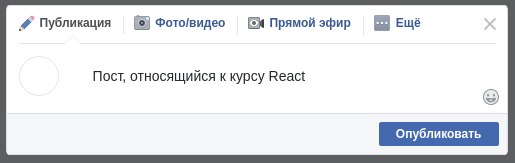
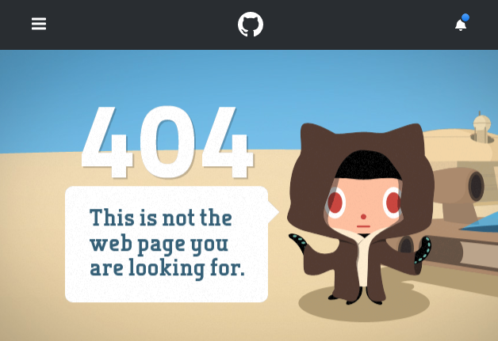

## **`!РЕШЕНО! «Hooks & Context API». Все задачи`**  
### Задачи разделены по компонентам в папке components

---

### Ссылкка на [github-pages](https://rt-vinsent.github.io/ra16-hw-9/)

### Ссылкка на [backend репозиторий](https://github.com/RT-Vinsent/ra16-hw-9-backend)

---

[](https://ci.appveyor.com/project/RT-Vinsent/ra16-hw-9)

[](https://github.com/RT-Vinsent/ra16-hw-9/actions/workflows/pages/pages-build-deployment)

---

React Router. Все задачи
===

Необходимо выполнить и предоставить на проверку следующие задачи:

<details>
<summary>1. Меню.</summary>

## Навигационное меню

Необходимо реализовать меню для сайта гоночного такси с пунктами «Главная», «Дрифт-такси», «Time Attack» и «Forza Karting». При переходе на страницу соответствующий пункт меню должен подсветиться:  


## Описание компонента

Компонент должен создавать HTML-разметку вида:
```html
<nav class="menu">
  <a class="menu__item" href="/">Главная</a>
  <a class="menu__item" href="/drift">Дрифт-такси</a>
  <a class="menu__item" href="/timeattack">Time Attack</a>
  <a class="menu__item" href="/forza">Forza Karting</a>
</nav>
```
Активный пункт меню помечается классом `menu__item-active`.

## Реализация

Необходимо реализовать компонент `Menu`.

Воспользуйтесь готовым файлом `App.js` и стилями `css/index.css` из каталога в качестве отправной точки. Замените ими те, что создаются в create-react-app.

**Обратите внимание**: в файлах `App.js` расположено несколько компонентов не потому, что так нужно делать, а чтобы вам было удобнее копировать. Будет хорошо, если в своём решении вы разнесёте их по разным файлам.


</details>

<details>
<summary>2. CRUD.</summary>

## CRUD

Вам необходимо реализовать CRUD при работе с HTTP с использованием Router.

Backend вы можете либо написать сами, либо взять готовый из каталога `backend`.


Нас интересует только ID, content и created, в качестве остальных значений вроде имени и фото, можете поставить заглушки.

## Общая механика

При нахождении на странице `/` отображается список существующих постов, GET на адрес http://localhost:7070/posts. Полученные данные отображаются в виде карточек:


Кнопка «Создать пост» ведёт на страницу добавления (см. ниже) `/posts/new`. Помните про регулярные выражения.

При клике на саму карточку происходит переход на страницу просмотра поста (см. ниже) `/posts/{postId}`.

### Страница создания

На странице создания `/posts/new` отображается карточка создания:



При нажатии на кнопку «Опубликовать» пост сохраняется, после чего осуществляется редирект на главную страницу. POST на адрес http://localhost:7070/posts body: `{"id": 0, "content": "То, что введено в поле ввода"}`.

При нажатии на крестик в верхнем правом углу происходит редирект на главную без сохранения. Advanced: можете сохранить в localStorage и потом вытаскивать оттуда.

### Страница просмотра

На странице просмотра `/posts/{id}` отображается карточка просмотра:


При клике на кнопку «Удалить» происходит удаление поста, после чего осуществляется редирект на главную страницу. DELETE на адрес http://localhost:7070/posts/{id}.

При клике на кнопку «Редактировать» карточка просмотра заменяется карточкой редактирования:


На карточке редактирования:
* кнопка «Сохранить» приводит к сохранению поста и  отображению карточки просмотра с обновлёнными данными. POST на адрес http://localhost:7070/posts body: `{"id": не 0, "content": "То, что введено в поле ввода"}`;
* кнопка крестик приводит к возврату к карточке просмотра.

**Важно**:

1. Не смотрите на то, как это реализовано на Фейсбуке — механика изменена.
1. Но вы можете подглядеть, как пользователю отображается загрузка, сетевые операции добавления, сохранения, удаления.
1. React Router позволяет использовать регулярные выражения в роутах: https://github.com/pillarjs/path-to-regexp/tree/v1.7.0.


</details>

<details>
<summary>3. authentication — необязательная задача.</summary>

## Authentication

Вы решили модернизировать систему с аутентификацией, используя знания, полученные о роутере.

Используя сервер, расположенный в каталоге `backend`, реализуйте приложение, удовлетворяющее следующим условиям:

1. При первой загрузке показывается лэндинг с формой входа (url = /):


2. После авторизации (POST http://localhost:7070/auth `{"username": "vasya", "password": "vasya"}`), загружаются компоненты ленты новостей и в тулбаре отображается профиль с кнопкой выйти (url = /news):


Для запроса профиля используйте запрос вида:
```
GET http://localhost:7070/private/me
Authorization: Bearer <ваш_токен>
```

Для запроса новостей используйте запрос вида:
```
GET http://localhost:7070/private/news
Authorization: Bearer <ваш_токен>
```

3. При нажатии на кнопку «Выйти» URL происходит редирект на главную страницу (url = /).

4. Каждая новость кликабельна, при клике на новость открывается страница, на которой показана только карточка этой новости (url = /news/{id}). 

5. Если пользователь не аутентифицирован, то попытка зайти на /news или /news/{id} должна приводить к редиректу на главную страницу (url = /).

Важно:
1. Профиль и токен должны храниться в localStorage/sessionStorage. При перезагрузке страницы должна также загружаться лента новостей, если мы аутентифицированы)
1. Должна быть обработка ошибок, если получена ошибка 401, то нужно разлогинивать пользователя и удалять всё из localStorage/sessionStorage.
1. Должна быть обработка ошибок, если получена ошибка 404, например, пользователь в аутентифицированном режиме вручную вбил в адресную строку /news/00000000-0000-0000-0000-000000000000, то должна отрисовываться страница 404 — просто тулбар + большими буквами Not Found. Например, как на GitHub:




</details>

---

</br>

Все три задачи лучше сдавать в разных репозиториях, то есть через create-react-app реализовать три проекта, чтобы не
было конфликта стилей. Но если вы позаботитесь о том, что конфликта не будет, то можете сдавать и в одном проекте.

#### Альтернативный способ создания приложения React с использованием тулинга Vite

Приложение также можно создать используя инструмент Vite.
Документация по созданию приложения [React](https://vitejs.dev/guide/).

1. Откройте терминал и пропишите следующую команду: `yarn create vite my-app --template react`,
   либо `yarn create vite my-app --template react-ts`, если
   нужен шаблон с TypeScript. Эта команда создаст настроенный
   шаблонный проект.
2. Откройте созданный проект в своей IDE.
3. Установите зависимости.
4. Готово. Чтобы запустить приложение, введите команду: `yarn dev`(либо `npm run dev`).
